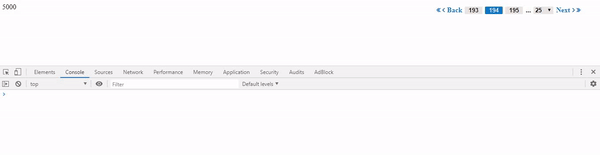

```
  "description": "A simple paginator component that improves the experience of pagination import the paginator module into your root module and make the paginator component as your child component set the noOfRecords property on the paginator component through property binding and hangle the paginatorEvent emitted by thr paginator component and you are all set to go..",
```