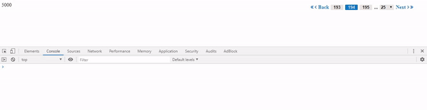

 "A simple paginator component that improves the experience of pagination import the paginator module into your root module and make the paginator component as your child component set the noOfRecords property on the paginator component through property binding and hangle the paginatorEvent emitted by the paginator component and you are all set to go..",

import paginator module into your root module 
 ```
import { BrowserModule } from '@angular/platform-browser';
import { NgModule } from '@angular/core';

import { AppRoutingModule } from './app-routing.module';
import { AppComponent } from './app.component';
import {NgPaginatorModule} from '../../projects/ng-paginator/src/lib/ng-paginator.module';
import { FormsModule } from '@angular/forms';
@NgModule({
  declarations: [
    AppComponent
  ],
  imports: [
    BrowserModule,
    AppRoutingModule,
    NgPaginatorModule,
    FormsModule
  ],
  providers: [],
  bootstrap: [AppComponent]
})
export class AppModule { }
 ```

Make paginator component as a child component of your root component and set the recordsCount property on the paginator based on the number of records over which you want to paginate.

Handle the paginatorEvent that gets fired when there is a change number of records shown per page which can be changed using the dropdown select to the right.

The same event gets Fired when you click on the page number to which you want to navigate.

The no of pages change based on the number of records and the number of records per page.

paginatorEvent emits an object with three properties

```
{activePage: 2, noOfRecords: 50, totalPages: 100}
```
activePage refers to the current page you are viewing.
noOfRecords refers to the number of records you are viewing on each page.
totalPages refers to the total number of pages you can paginate over.

 ```
 <lib-ng-paginator [recordsCount]="5000" (paginatorEvent)="pagination($event)"></lib-ng-paginator>
 ```